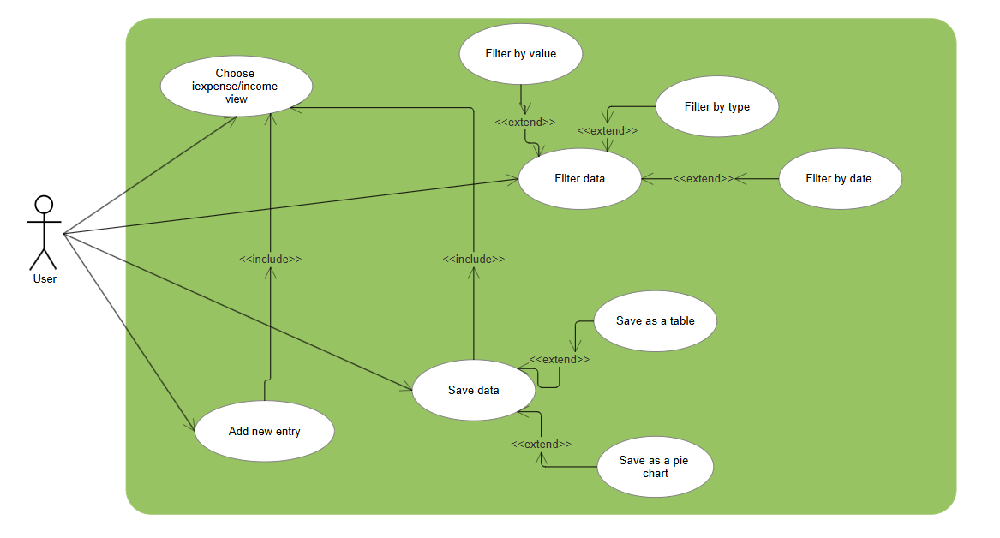
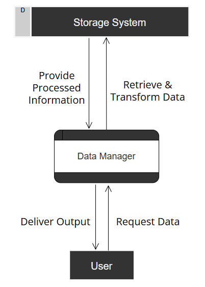
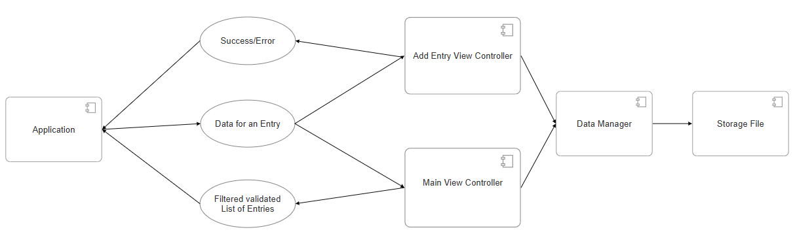

# Finance Manager App

## Team: *Unhandled Exception*

### Authors
| Name               | Role                                      |
|--------------------|-------------------------------------------|
| **Robert Šatkevič** | Backend Developer, Documentation Writer, Tester, Quality Assurance   |
| **Aurimas Vižinis** | Frontend Developer, Documentation Writer, Presenter, Communication Specialist  |

---

## Description
The Finance Manager App is a comprehensive tool designed to help users manage their finances effectively. It allows users to track income and expenses, apply filters, and visualize data through tables and pie charts. The app also supports exporting filtered data for further analysis.

---

## Features Overview

### Use Case Diagram

- **User Interactions:**
  - The diagram illustrates how the user interacts with the system, including choosing between income or expense views, adding new entries, filtering data by value, type, or date, and saving/exporting data as tables or pie charts.

---

## Analysis

### Data Flow Overview

#### Flowchart Diagram

- This diagram shows the flow of data within the application:
  1. **User Input** is validated.
  2. Valid data is saved to a **Storage File**.
  3. Filters are applied to view data as a **Table** or **Pie Chart**.
  4. Data can be exported or saved.

---

### Application Flow

#### Component Interaction Diagram

- This diagram represents the interaction between components:
  - The **Application** communicates with **View Controllers** (Main and Add Entry).
  - **View Controllers** interact with the **Data Manager**, which handles data storage and retrieval from the **Storage File**.

---

## Technology Stack

| Layer         | Technology Used      |
|---------------|-----------------------|
| **Frontend**  | C++, QT |
| **Backend**   | C++    |
| **Storage**   | Local File System           |
| **Visualization** | Pie Charts, Tables |
| **Tools**     | QT Creator, Smartdraw, Git/GitHub |

